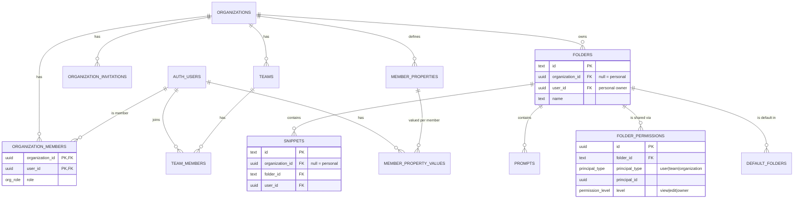

# SprintBrain — Enterprise Organizations, Teams & Permissions

**Status:** Architecture proposal (design only — nothing in here is applied to the DB or shipped).
**Author:** Senior-architect review pass, 2026-06-06.
**Baseline:** Verified against the live Supabase schema + RLS on 2026-06-06 (see §1).

> Read this alongside `app/CLAUDE.md` (§4.8 Auth + RLS) and `docs/ENGINEERING_REFERENCE.md`.
> This document is the contract for the 9 deliverables requested in the feature spec.

---

## 0. Executive summary — the decisions that matter

The spec asks for a Text-Blaze-Business-style multi-tenant system, generalized to all asset
types. The spec's instincts are right; three architectural decisions make or break it, and I
recommend a path that differs from the most literal reading of the spec:

1. **Personal workspace = `organization_id IS NULL`.** Every existing user-owned row stays
   exactly as-is (personal). Org features are *additive*. This is what makes the migration
   non-breaking — the current RLS branch (`auth.uid() = user_id`) is preserved verbatim and a
   new org branch is OR'd in. No data is rewritten on day one.

2. **The folder is the permission boundary; assets inherit. Permissions never reference an
   asset *type*.** This satisfies the spec's "don't tie permissions to snippets" requirement
   *without* collapsing snippets/prompts/SOPs into one mega-table. A folder gets a permission
   grant; everything inside it (snippet, prompt, future SOP/agent) inherits. Any new asset type
   becomes shareable for free by adding two columns (`organization_id`, `folder_id`).
   **→ I recommend against a single `assets` table** (see §1.3 — it would break the extension's
   direct `snippets` reads and force a destructive migration for zero functional gain).

3. **RLS uses `SECURITY DEFINER` membership/permission functions, not inline subqueries.**
   This is non-negotiable: naive policies that subquery `organization_members` from a policy
   *on* `organization_members` cause **infinite recursion** (the #1 Supabase multi-tenant bug).
   Definer functions break the loop and centralize the access logic. JWT claims are a later
   optimization (§4.4), not the starting point.

**Scope honesty (challenge to the spec):** SprintBrain today is one org (LeibTour, 3 users) and
the product's stated #1 principle is simplicity. The *foundation* (tenancy columns + RLS) should
be built correctly now because retrofitting tenancy later is brutal — but the *surface area*
(team admins, default-folder auto-assignment, member properties, analytics, billing) should be
phased, and several pieces should land as **schema-only stubs** until a real second
organization exists. The recommended order in §9 front-loads the two phases that deliver ~all
near-term value (foundation + folder sharing) and defers the rest.

---

## 1. Architecture Review

### 1.1 Current state (verified live)

| Table | Rows | Ownership | Notes |
|---|---|---|---|
| `folders` | 3 | `user_id` (uuid) | `id` is **text**; cols: name, ico, sort_order, timestamps. No description/visibility/org. |
| `snippets` | 139 | `user_id` (uuid) | `id` **text**; `folder_id` text FK→folders (nullable); `is_shared` bool; `notion_page_id` unique. |
| `prompts` | 3 | `user_id` (uuid) | `id` **uuid**; **no `folder_id`** — not foldered today. |
| `snippet_stats` | 53 | `user_id` | PK `snippet_id`. |
| `snippet_events` | 793 | `user_id` (nullable) | append-only analytics. |
| `notion_sync_log` | 0 | `user_id` (nullable) | per-user sync log. |
| `snippet_revisions` | ? | (via RPC) | referenced by `save_snippet_with_revision` (SECURITY DEFINER); **verify live state** — did not appear in `list_tables` and needs confirmation before scoping. |

- **RLS is already correct and tight** per-user on every table (`auth.uid() = user_id`; snippets
  SELECT additionally allows `is_shared = true`). The extension authenticates per-user via JWT
  (`extension/auth/auth.js`). There are **no** permissive `team_*` policies. (AUTH-EXT-001 is shipped.)
- **Sharing today** = `is_shared` boolean → readable by every authenticated user. Single tenant,
  so "everyone" = LeibTour. **This does not survive multi-tenancy** (see §8, R2).
- **Notion sync** = single shared team Notion DB + per-user credentials in `auth.users.user_metadata`.
  Tenant-blind (see §8, R5).

### 1.2 Target model

```
auth.users ──< organization_members >── organizations ──< teams ──< team_members >── (users)
                                            │
                                            ├──< folders (organization_id nullable = personal)
                                            │       │
                                            │       ├──< snippets   (folder_id, organization_id)
                                            │       ├──< prompts    (folder_id, organization_id)  ← add folder_id
                                            │       └──< <future assets> (folder_id, organization_id)
                                            │
                                            ├──< folder_permissions  (folder_id, principal{user|team|org}, level{view|edit|owner})
                                            ├──< default_folders      (scope{org|team}, folder_id)
                                            ├──< organization_invitations
                                            └──< member_properties / member_property_values
```

**Two orthogonal access systems** — keep them separate (the spec blends them):

- **RBAC (roles)** — `admin | manager | member` on `organization_members`; `admin | member` on
  `team_members`. Roles gate **management actions** (invite, create team, set defaults). Enforced
  in the service layer and in RLS on the *org/team/permission* tables.
- **ABAC/ACL (folder permissions)** — `view | edit | owner` grants to a principal
  (user / team / org). Gate **asset access**. Enforced in RLS on the *asset* tables via the
  folder. Org `admin` is an implicit `owner` of all org folders (override).

### 1.3 Challenge: single `assets` table vs. folder-as-boundary

The spec says permissions must be generic across assets. **Two ways to achieve that:**

| Option | How | Verdict |
|---|---|---|
| **A. Mega `assets` table** | Collapse snippets+prompts+SOPs into one table with `type` + `jsonb data`; permissions reference asset rows. | ❌ **Reject.** Breaks the extension's direct `/rest/v1/snippets` reads; loses type-specific columns/constraints (snippets: shortcut/lang/bodies/urgency; prompts: strategy/blocks); forces a destructive 139+3-row migration; couples all features to one hot table. |
| **B. Folder = boundary, per-type tables inherit** *(recommended)* | Permissions live on `folders`. Each asset table keeps its own shape + gains `organization_id` + `folder_id`. Access = "can you access the containing folder?" | ✅ Backward-compatible, extension untouched, type-safe, and *generic at the container level* — new asset types are shareable by adding 2 columns. |
| **C. Optional asset *registry*** | A thin `assets(id, org_id, folder_id, kind, source_table, source_id)` index over per-type tables, for cross-type search/links later. Permissions still on folders. | 🔶 Defer. Add only if cross-type operations (unified search, per-asset grants) become real. |

**Recommendation: B now, C later if needed.** The generality the spec wants is real and
achieved — it just lives on the folder, not on a homogenized asset store.

---

## 2. Database Schema Proposal

> Proposed DDL — **not applied**. UUID PKs for all new tables. FKs to `folders`/`snippets` use
> `text` to match existing PKs; FKs to `prompts` use `uuid`.

### 2.1 New tables

```sql
-- Tenancy root
create table organizations (
  id           uuid primary key default gen_random_uuid(),
  name         text not null,
  slug         text unique,
  created_by   uuid not null references auth.users(id),
  created_at   timestamptz not null default now(),
  updated_at   timestamptz not null default now()
);

create type org_role as enum ('admin', 'manager', 'member');

create table organization_members (
  organization_id uuid not null references organizations(id) on delete cascade,
  user_id         uuid not null references auth.users(id) on delete cascade,
  role            org_role not null default 'member',
  created_at      timestamptz not null default now(),
  primary key (organization_id, user_id)
);

create table organization_invitations (
  id              uuid primary key default gen_random_uuid(),
  organization_id uuid not null references organizations(id) on delete cascade,
  email           text not null,
  role            org_role not null default 'member',
  token           uuid not null default gen_random_uuid(),
  invited_by      uuid not null references auth.users(id),
  status          text not null default 'pending'
                    check (status in ('pending','accepted','revoked','expired')),
  expires_at      timestamptz not null default (now() + interval '14 days'),
  created_at      timestamptz not null default now(),
  unique (organization_id, email)
);

create table teams (
  id              uuid primary key default gen_random_uuid(),
  organization_id uuid not null references organizations(id) on delete cascade,
  name            text not null,
  description     text,
  created_by      uuid not null references auth.users(id),
  created_at      timestamptz not null default now()
);

create type team_role as enum ('admin', 'member');

create table team_members (
  team_id    uuid not null references teams(id) on delete cascade,
  user_id    uuid not null references auth.users(id) on delete cascade,
  role       team_role not null default 'member',
  created_at timestamptz not null default now(),
  primary key (team_id, user_id)
);

-- Folder ACL — the generic permission surface
create type permission_level as enum ('view', 'edit', 'owner');
create type principal_type   as enum ('user', 'team', 'organization');

create table folder_permissions (
  id              uuid primary key default gen_random_uuid(),
  folder_id       text not null references folders(id) on delete cascade,
  principal_type  principal_type not null,
  principal_id    uuid not null,         -- user_id | team_id | organization_id (resolved by type)
  level           permission_level not null default 'view',
  granted_by      uuid not null references auth.users(id),
  created_at      timestamptz not null default now(),
  unique (folder_id, principal_type, principal_id)
);

-- Default folders (auto-available to a scope's members) — resolved dynamically, not materialized
create table default_folders (
  id              uuid primary key default gen_random_uuid(),
  folder_id       text not null references folders(id) on delete cascade,
  scope_type      text not null check (scope_type in ('organization','team')),
  scope_id        uuid not null,          -- organization_id | team_id
  level           permission_level not null default 'view',
  created_at      timestamptz not null default now(),
  unique (folder_id, scope_type, scope_id)
);

-- Member properties (schema now; UI + snippet-variable wiring later, per spec)
create table member_properties (              -- definitions, per org
  id              uuid primary key default gen_random_uuid(),
  organization_id uuid not null references organizations(id) on delete cascade,
  key             text not null,              -- e.g. 'phone', 'job_title', 'email_signature'
  label           text not null,
  data_type       text not null default 'text' check (data_type in ('text','number','date','boolean')),
  created_at      timestamptz not null default now(),
  unique (organization_id, key)
);

create table member_property_values (         -- values, per member
  organization_id uuid not null references organizations(id) on delete cascade,
  user_id         uuid not null references auth.users(id) on delete cascade,
  property_id     uuid not null references member_properties(id) on delete cascade,
  value           text,
  primary key (property_id, user_id)
);
```

### 2.2 Alterations to existing tables (additive, nullable → non-breaking)

```sql
alter table folders  add column organization_id uuid references organizations(id);
alter table folders  add column description text;
alter table snippets add column organization_id uuid references organizations(id);
alter table prompts  add column organization_id uuid references organizations(id);
alter table prompts  add column folder_id text references folders(id);   -- prompts become foldered
-- Every future asset table follows the same two-column contract: (organization_id, folder_id).
```

`organization_id IS NULL` ⇒ personal asset (current behavior, unchanged).
`organization_id = X` ⇒ org asset, access governed by folder permissions within org X.

**Deprecate `snippets.is_shared`** — replaced by folder ACL. Keep the column through the
migration window (set false everywhere once data is moved), then drop it (§7).

---

## 3. ER Diagram



---

## 4. RLS Strategy

### 4.1 Principles

- **Personal branch preserved.** Every asset policy keeps `user_id = auth.uid()` for personal rows.
- **Org branch added** via a `SECURITY DEFINER` access function (no inline subqueries → no recursion).
- **Deny by default.** No `is_shared = true` global read. Org access requires an explicit (or
  default-derived) folder grant, or org-admin override.
- Membership/permission tables get their **own** policies, written so they never recurse.

### 4.2 Access helper functions (the core of the design)

```sql
-- Bypasses RLS (definer) to read membership without recursion. STABLE + pinned search_path.
create or replace function app.is_org_member(p_org uuid)
returns boolean language sql stable security definer set search_path = public as $$
  select exists (select 1 from organization_members
                  where organization_id = p_org and user_id = auth.uid());
$$;

create or replace function app.org_role(p_org uuid)
returns org_role language sql stable security definer set search_path = public as $$
  select role from organization_members
   where organization_id = p_org and user_id = auth.uid();
$$;

-- Resolves folder read access: direct user grant OR team grant OR org-wide grant OR
-- org-default OR org-admin override. Returns the effective level or null.
create or replace function app.folder_level(p_folder text)
returns permission_level language sql stable security definer set search_path = public as $$
  with f as (select id, organization_id, user_id from folders where id = p_folder)
  select case
    when (select user_id from f) = auth.uid() then 'owner'::permission_level
    when (select organization_id from f) is not null
         and app.org_role((select organization_id from f)) = 'admin' then 'owner'::permission_level
    else (
      select max(level)  -- enum ordered view<edit<owner; use an ordering map in practice
      from folder_permissions fp
      where fp.folder_id = p_folder and (
            (fp.principal_type='user'         and fp.principal_id = auth.uid())
         or (fp.principal_type='organization' and app.is_org_member(fp.principal_id))
         or (fp.principal_type='team'         and fp.principal_id in
               (select team_id from team_members where user_id = auth.uid())))
      )
  end;
$$;

create or replace function app.can_read_folder(p_folder text)
returns boolean language sql stable security definer set search_path = public as $$
  select app.folder_level(p_folder) is not null
      or exists (select 1 from default_folders d                      -- dynamic defaults
                  where d.folder_id = p_folder
                    and ((d.scope_type='organization' and app.is_org_member(d.scope_id))
                      or (d.scope_type='team' and d.scope_id in
                            (select team_id from team_members where user_id = auth.uid()))));
$$;

create or replace function app.can_write_folder(p_folder text)
returns boolean language sql stable security definer set search_path = public as $$
  select app.folder_level(p_folder) in ('edit','owner');
$$;
```

> `max(level)` over an enum is illustrative — implement level precedence with an explicit
> `view<edit<owner` ranking (small mapping function) to combine multiple grants correctly.

### 4.3 Representative policies (pattern repeats for every asset table)

```sql
-- SNIPPETS: personal OR readable-via-folder
drop policy "snippets: select own or shared" on snippets;   -- removes the is_shared global read
create policy "snippets_select" on snippets for select to authenticated using (
  user_id = auth.uid()
  or (organization_id is not null and folder_id is not null and app.can_read_folder(folder_id))
);
create policy "snippets_write" on snippets for update to authenticated using (
  user_id = auth.uid()
  or (organization_id is not null and folder_id is not null and app.can_write_folder(folder_id))
) with check (
  user_id = auth.uid()
  or (organization_id is not null and folder_id is not null and app.can_write_folder(folder_id))
);
-- insert: must target a folder you can write (or personal); delete: owner/edit or personal.

-- ORGANIZATION_MEMBERS: members see co-members; only admins mutate. No self-subquery →
-- the SELECT policy uses is_org_member (definer) which does NOT re-trigger this policy.
create policy "org_members_select" on organization_members for select to authenticated
  using (app.is_org_member(organization_id));
create policy "org_members_admin_write" on organization_members for all to authenticated
  using (app.org_role(organization_id) = 'admin')
  with check (app.org_role(organization_id) = 'admin');

-- FOLDER_PERMISSIONS: visible to org members; mutable by folder owners + org admins.
create policy "folder_perms_select" on folder_permissions for select to authenticated
  using (app.can_read_folder(folder_id));
create policy "folder_perms_manage" on folder_permissions for all to authenticated
  using (app.folder_level(folder_id) = 'owner')
  with check (app.folder_level(folder_id) = 'owner');
```

**Rationale:** the definer functions are the *only* place that reads membership/permission tables
from within a policy, so a policy on `organization_members` never recursively evaluates itself.
Org-admin override and default-folder resolution are centralized in `folder_level` /
`can_read_folder`, so every asset table's policy stays a one-liner and future asset types reuse it.

### 4.4 Performance: JWT claims (later optimization)

`can_read_folder` runs per row. At small scale (one org, hundreds of rows) this is fine. At
enterprise scale, add a Supabase **custom access token hook** that embeds the user's
`org_ids` + `roles` into the JWT; the functions then read `auth.jwt()` instead of hitting tables.
Trade-off: claims are stale until token refresh (~1h) — membership changes apply on next refresh
or a forced refresh. **Start with definer functions (always fresh); add JWT claims only when
profiling shows the need.** Don't pay this complexity up front.

---

## 5. Index Strategy

```sql
-- membership lookups (hit on every permission check)
create index on organization_members (user_id);
create index on team_members (user_id);
create index on team_members (team_id);
-- permission checks
create index on folder_permissions (folder_id);
create index on folder_permissions (principal_type, principal_id);
create index on default_folders (scope_type, scope_id);
-- folder/asset retrieval, tenant-scoped
create index on folders  (organization_id);
create index on snippets (organization_id, folder_id);
create index on prompts  (organization_id, folder_id);
-- keep existing per-user indexes; add partial for personal hot path
create index on snippets (user_id) where organization_id is null;
```

Membership/permission functions are `STABLE`, so Postgres caches their result within a statement —
combined with the above indexes, per-row checks stay cheap until JWT claims take over.

---

## 6. API / Service Layer

`app/src/lib/api/` gains one service per domain. All return typed results (no `any`), validate
with Zod, and surface typed errors. RLS is the backstop; services enforce role rules for clear UX.

| Service | Responsibilities | Key validation / errors |
|---|---|---|
| `organizationService` | create org, rename, get-with-membership, delete (admin-only, blocks last admin) | `LastAdminError`, `NotAdminError` |
| `membershipService` | invite (creates invitation + email), accept/revoke, change role, remove member | `AlreadyMemberError`, `InvitationExpiredError`, last-admin guard |
| `teamService` | CRUD teams, add/remove team members, set team admin, enforce ≤5 teams/user (soft) | `TeamLimitWarning` (soft), `NotOrgManagerError` |
| `permissionService` | grant/revoke folder permission (user/team/org), list a folder's grants, compute effective level | `NotFolderOwnerError`, idempotent grants |
| `folderService` | folder CRUD with org scoping, move asset between folders, mark/unmark default | reassignment-on-delete policy (§8 R6) |
| `memberPropertyService` | (phase E) define properties, set values, resolve into snippet variables | — |

**Contract conventions:** every method takes the acting user from the session (never trusts a
client-passed `user_id`), returns `Result<T>`-style typed objects, and maps Postgres RLS denials
(`42501`) to a friendly `ForbiddenError`. Mutations are optimistic in the store with rollback
(matches existing `snippetStore` pattern).

---

## 7. Frontend Structure

Desktop-only, Tailwind tokens, Zustand-per-feature (existing conventions). New area under a
`/org` route guarded by org membership; role gates hide/disable management controls.

```
routes/
  OrgDashboardLayout.tsx        # tabs: Overview · Members · Teams · Folders · Permissions
  org/OverviewPage.tsx
  org/MembersPage.tsx           # table: email · invite status · role select · remove (admin)
  org/TeamsPage.tsx             # team cards: members chips + default-folder chips; Create/Edit
  org/FoldersPage.tsx           # org folders + visibility + default toggles
features/org/
  InviteMemberDialog.tsx        # email(s) + role
  RoleSelect.tsx                # admin/manager/member (disabled unless admin)
  TeamEditor.tsx                # name, desc, members, default folders, team-admin toggle
  FolderShareModal.tsx          # ← the centerpiece
stores/
  orgStore.ts  teamStore.ts  permissionStore.ts
```

**FolderShareModal** (the core UX, mirrors the Text Blaze benchmark): pick principal
(user / team / whole organization) → pick level (View / Edit / Owner) → list existing grants with
inline level-change + revoke. Owner-only controls; org-admin sees all. This is the single screen
that delivers most of the perceived value.

**Members/Teams screens** follow the screenshots you shared (invite row + role dropdowns; team
cards with member + default-folder chips; team-member role popup = Member vs Admin).

---

## 8. Risks & Edge Cases

| # | Risk | Mitigation |
|---|---|---|
| **R1** | **RLS infinite recursion** (policy on `organization_members` subqueries itself). | All membership reads go through `SECURITY DEFINER` functions (§4.2). Never inline-subquery the same table a policy guards. |
| **R2** | **`is_shared = true` becomes a cross-tenant leak** (would expose a row to *every* org). | Retire the global-read policy in the same migration that adds folder ACL. Migrate existing shared snippets into a shared folder with org-scoped VIEW, then set `is_shared = false` and drop the column. |
| **R3** | **`save_snippet_with_revision` RPC** branches on `is_shared = TRUE`. | Rewrite its guard to `app.can_write_folder(folder_id)`; keep it SECURITY DEFINER but re-check folder write permission for the caller. |
| **R4** | **Extension reads snippets flat** (`or=(user_id.eq,is_shared.eq.true)`). | Switch the extension's `loadData()` to a permission-aware read (RPC or view returning accessible snippets). Lands with Phase B. |
| **R5** | **Notion sync is tenant-blind** (one shared DB + per-user creds). | Move Notion config to org level (`organizations.notion_*` or a per-org settings table); scope `notion-snippet-push` by org. |
| **R6** | **Orphaned assets** when a folder is deleted or a member removed. | Define policy: folder delete → reassign assets to org "Unfiled" (or personal for personal folders); member removal → assets owned by org remain, personal stay personal. |
| **R7** | **Last admin leaves** → headless org. | Block removing/downgrading the final `admin` (service + trigger), mirroring Text Blaze. |
| **R8** | **Mixed ID types** (text folders/snippets vs uuid prompts). | New FKs match existing types (folder_id text, prompt refs uuid). Don't "normalize" existing PKs — that's a destructive, extension-breaking change. |
| **R9** | **Personal → org asset move** (changing `organization_id`). | Only owner/admin; on move, clear personal-only assumptions and apply folder ACL. Define as explicit `folderService.moveToOrg`. |
| **R10** | **`snippet_revisions` live state unconfirmed.** | Verify it exists + add `organization_id` scoping before Phase B touches the revision RPC. |
| **R11** | **Cross-domain invites / open signup.** | Per-org setting (Text Blaze "allow sharing across domains"); invitations are the only join path (domain allowlist was already dropped). |
| **R12** | **Seat counting for future billing.** | Derive from `organization_members` count; no payment integration now (no pricing decided) — just keep the count queryable. |

---

## 9. Recommended Implementation Order

Each phase is independently shippable, reversible, and leaves the product working. Phases A–B
deliver essentially all near-term value for LeibTour; C–F activate when a real second org appears.

| Phase | Scope | Ships value? | Notes |
|---|---|---|---|
| **A — Tenancy foundation** | org/team/membership/invitation tables; `organization_id` columns (nullable); helper functions; additive RLS (personal branch untouched). Backfill LeibTour as an org behind the scenes. | Invisible | The risky-to-retrofit part, done first. Zero UX change. |
| **B — Folder sharing** ⭐ | `folder_permissions`; FolderShareModal; permission-aware reads (dashboard **and** extension); retire `is_shared`; migrate existing shared snippets into a shared folder. | **High** | This is the feature you actually want. The Members/Teams UI is hollow without it. |
| **C — Members & roles** | Org dashboard Overview + Members; invite flow + invitation acceptance; role changes; last-admin guard. | Medium | Needed once there's a 2nd member to manage. |
| **D — Teams & defaults** | Teams CRUD, team admins, org/team default folders (dynamic resolution). | Medium | Pays off past ~10 users. |
| **E — Member properties** | tables now (schema), then UI + snippet-variable (`{user.*}`) resolution. | Low now | Spec already says schema-only first. |
| **F — Future** | analytics rollups, billing/seats, new asset types (SOPs, agents) — each validates the §1.3 generality by adding only `(organization_id, folder_id)`. | — | Proof the architecture holds. |

**Extension permission-awareness** lands with **Phase B** (plus the published-ID note: add the
Web-Store-assigned ID to `SPRINTBRAIN_EXTENSION_IDS` so the JWT handoff keeps working).

---

## 10. Product decisions (confirmed 2026-06-06)

1. **Multi-org per user:** supported in the DB (many memberships); the UI uses a single
   **active-organization switcher**.
2. **5-teams-per-user:** **soft** guideline — warn in the UI, not enforced by a DB trigger.
3. **Personal workspace persists** after joining an org (`organization_id IS NULL` stays valid);
   org membership is purely additive.
4. **"Owner"** is a **per-folder** permission plus an implicit **org-admin override** (admins are
   owner-equivalent on all org folders) — not a separate standalone org capability.
```
